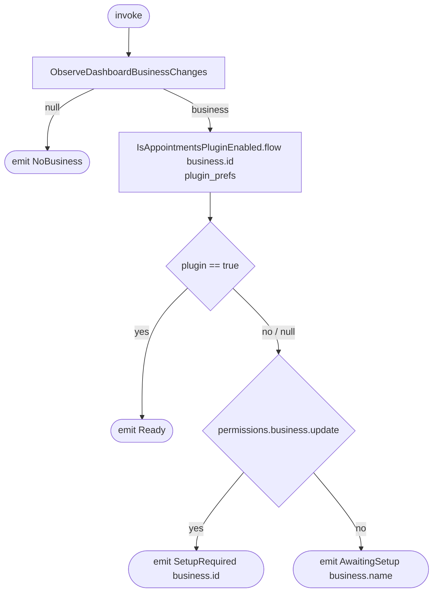

[← Operations](../README.md)

# Observe dashboard setup status

`ObserveDashboardSetupStatus()` → `Flow<DashboardSetupStatus>`, **local only**
· called from `DashboardViewModel`

Decides what the Home tab shows. It re-emits whenever the dashboard id, the business row or the plugin
preference changes. This includes right after [Create business](create-business.md) or
[Join business](join-business.md), because both switch the dashboard business.
The plugin flag counts as enabled only when it is exactly `true`. `null` ("not fetched yet") is treated as
disabled. `permissions.business.update` decides who is allowed to turn plugins on.

