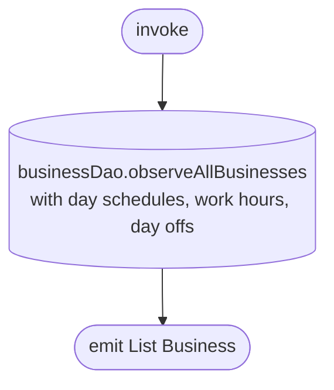

[← Operations](../README.md)

# Observe user businesses

`ObserveUserBusinessesChanges()` → `Flow<List<Business>>`, **local only** (`businessDao.observeAllBusinesses`)
· called from `BusinessDashboardViewModel` (business switcher)

Emits every row in `business`. Logout clears the table, so rows from a previous account never appear.
[Refresh business info](refresh-business-info.md) only upserts, so a business the user has left stays in
the list until the next logout.

