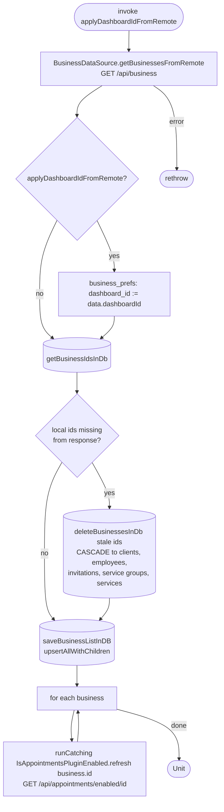

[← Operations](../README.md)

# Refresh business info

`RefreshBusinessInfo(applyDashboardIdFromRemote = false)` → `GET /api/business`
· called from `DashboardViewModel`, [Initiate business suspend](../authorization/initiate-business-suspend.md), [Create business](create-business.md), [Redeem employee
invitation](../employees/redeem-employee-invitation.md) and [Initial app data fetch](../authorization/initial-app-data-fetch.md)

Fetches every business the user can access, together with the server-side dashboard selection. The server's
dashboard id overwrites the local one only when `applyDashboardIdFromRemote` is true, which happens only in
`rawFetch()` right after sign-in or sign-up. If the local selection is `null` or points at a business that was
just deleted, it is left as is: the dashboard then shows its Get started screen, which lists the remaining
businesses to pick from.

Businesses stored locally but missing from the response (the user left, was removed, or the business is gone)
are deleted with `deleteBusinessesInDb` before the list is upserted. The `business` foreign keys cascade that
delete to the business's clients, employees, invitations, service groups and services. Appointment tables only
reference the business logically and are not cleaned up. Nothing is deleted when the fetch fails.

Then the use case refreshes the plugin flag for every business one at a time, ignoring failures for each
business.

