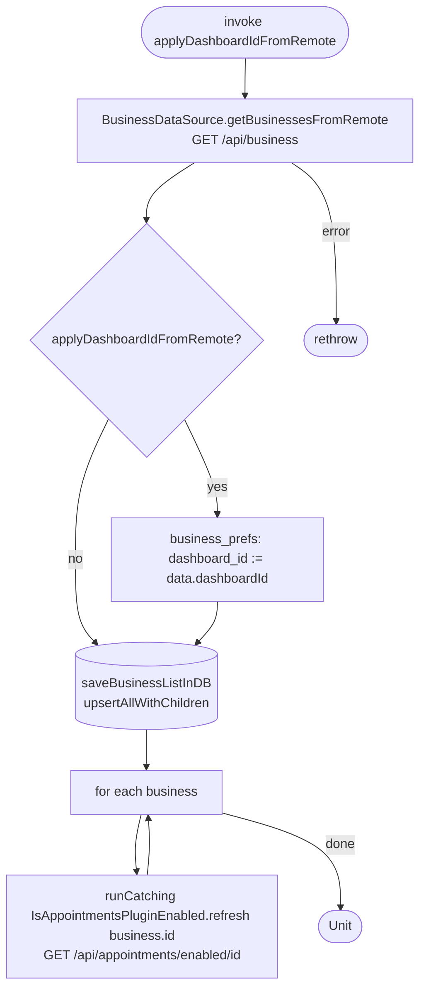

[← Operations](../README.md)

# Refresh business info

`RefreshBusinessInfo(applyDashboardIdFromRemote = false)` → `GET /api/business`
· called from `DashboardViewModel`, [Create business](create-business.md), [Redeem employee
invitation](../employees/redeem-employee-invitation.md) and [Initial app data fetch](../authorization/initial-app-data-fetch.md)

Fetches every business the user can access, together with the server-side dashboard selection. The server's
dashboard id overwrites the local one only when `applyDashboardIdFromRemote` is true, which happens only in
`rawFetch()` right after sign-in or sign-up. Then the use case refreshes the plugin flag for every business
one at a time, ignoring failures for each business.

The business list is **upsert-only**: businesses missing from the response are not deleted locally.

