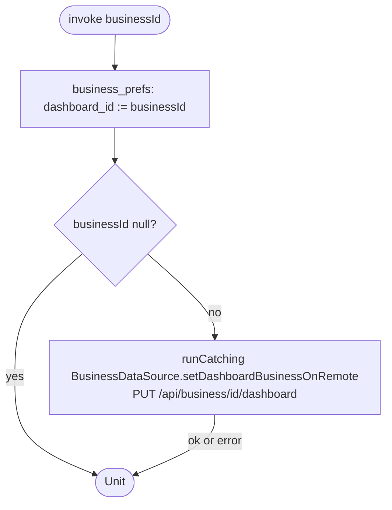

[← Operations](../README.md)

# Switch dashboard business

`SwitchDashboardBusiness(businessId: Uuid?)` → `PUT /api/business/{id}/dashboard`
· called from `BusinessDashboardViewModel`, `DashboardViewModel` (business picked on the Get started screen),
[Create business](create-business.md), [Redeem employee invitation](../employees/redeem-employee-invitation.md)
and [Initiate business suspend](../authorization/initiate-business-suspend.md) (with `null`)

A `null` id clears the local selection and skips the server call.

Local-first and best-effort: the preference is written right away, which switches every observing screen,
and a failure of the server call is **silently ignored**. The server copy is only read back by the
`rawFetch()` after the next sign-in.

