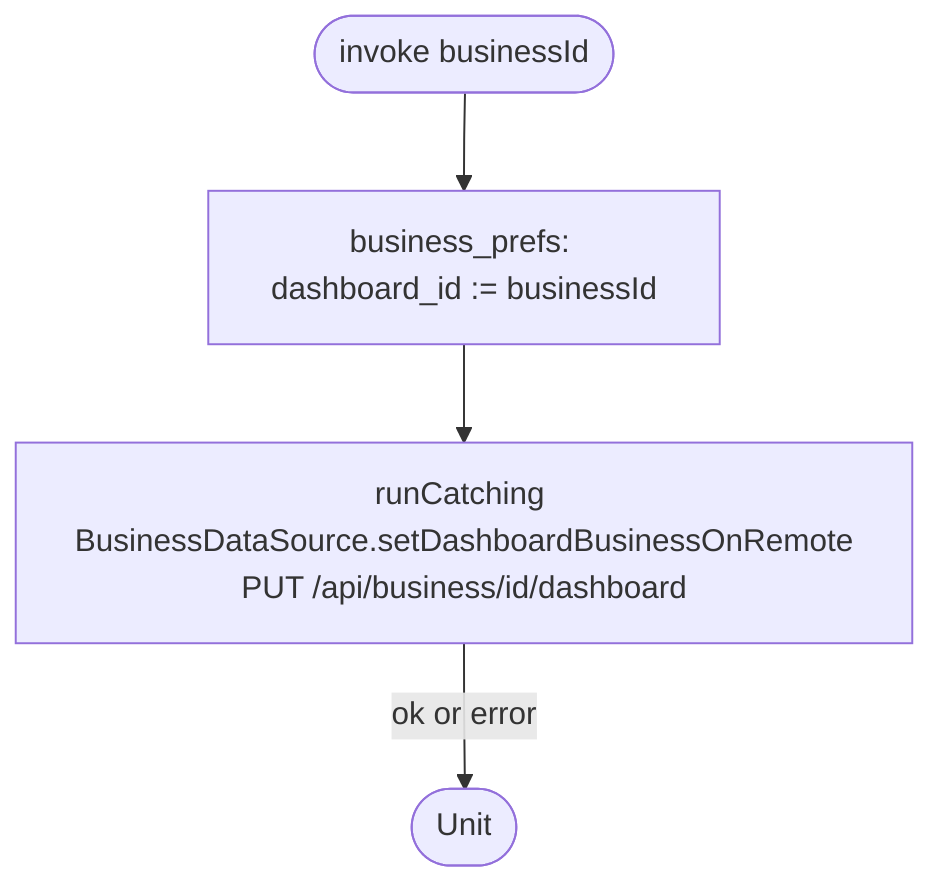

[← Operations](../README.md)

# Switch dashboard business

`SwitchDashboardBusiness(businessId)` → `PUT /api/business/{id}/dashboard`
· called from `BusinessDashboardViewModel`, [Create business](create-business.md) and [Redeem employee
invitation](../employees/redeem-employee-invitation.md)

Local-first and best-effort: the preference is written right away, which switches every observing screen,
and a failure of the server call is **silently ignored**. The server copy is only read back by the
`rawFetch()` after the next sign-in.

