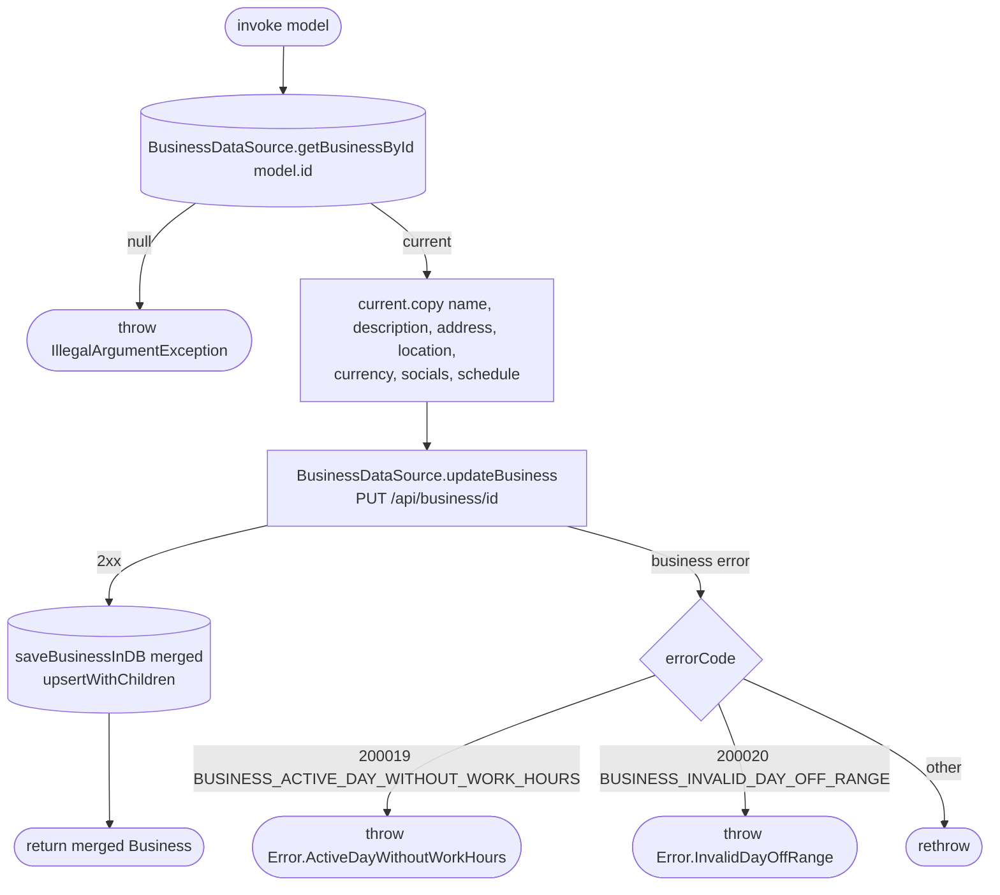

[← Operations](../README.md)

# Update business

`UpdateBusiness(model: Business.Update)` → `PUT /api/business/{id}`
· called from `BusinessSettingsViewModel`

Reads the cached business first and fails with `IllegalArgumentException` (`requireNotNull`) if it is not
cached. It copies the editable fields over the cached row, so fields that are not editable, such as the
permission columns and the time zone, are preserved. The PUT returns no body, so the **locally merged value**
is what gets written back to Room, not a server response.

