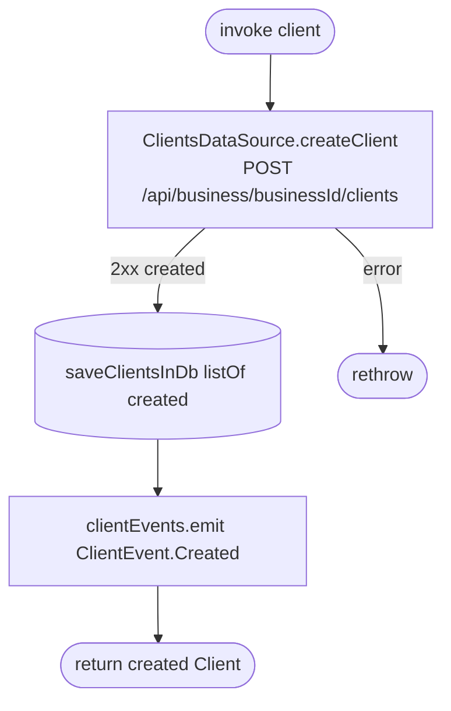

[← Operations](../README.md)

# Create client

`CreateClient(client)` → `POST /api/business/{businessId}/clients`
· called from `CreateClientViewModel`

The server does all validation (contact info, name, phone format, duplicate phone). The client maps no
business error codes, so every failure is rethrown as the generic error.

**Emits:** `ClientEvent.Created`. **Consumed by:** nobody. The list redraws because it observes the `client` table.
