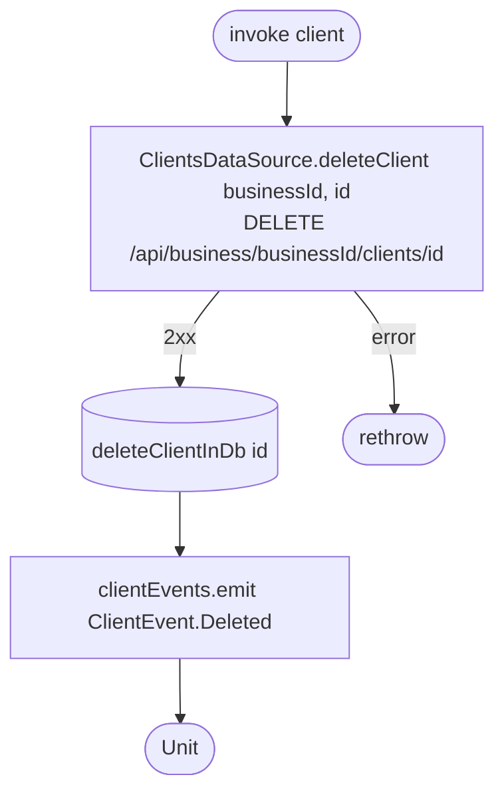

[← Operations](../README.md)

# Delete client

`DeleteClient(client)` → `DELETE /api/business/{businessId}/clients/{id}`
· called from `EditClientViewModel`

**Emits:** `ClientEvent.Deleted`. **Consumed by:** nobody.
