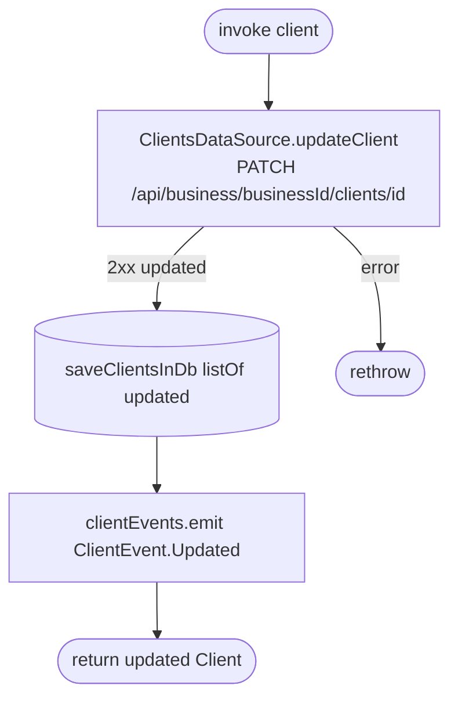

[← Operations](../README.md)

# Edit client

`EditClient(client)` → `PATCH /api/business/{businessId}/clients/{id}`
· called from `EditClientViewModel`

The route is sent as **PATCH**, even though bookk-server documents the route as `PUT`. Check the swagger before
changing either side.

**Emits:** `ClientEvent.Updated`. **Consumed by:** `ClientDetailsViewModel`, which re-renders the open
details screen with the updated client.
