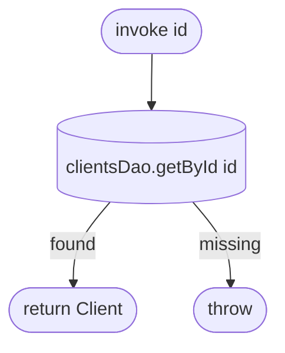

[← Operations](../README.md)

# Get client

`GetClient(id)` → **local only**, `clientsDao.getById(id)`
· called from `ClientDetailsViewModel` and `EditClientViewModel`

There is no network fallback, and `getById` is non-nullable, so an id that is not cached throws.

