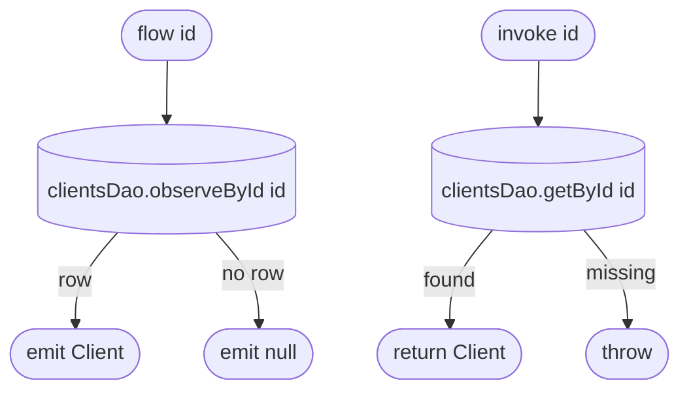

[← Operations](../README.md)

# Get client

`GetClient.flow(id)` / `GetClient(id)` → **local only**
· `flow` is called from `ClientDetailsViewModel`, `invoke` from `EditClientViewModel`

There is no network fallback. `flow(id)` observes the cached row and emits `null` while it is missing, so
the details screen redraws after [Edit client](edit-client.md) saves the server result. `invoke(id)` reads
the row once, and `getById` is non-nullable, so an id that is not cached throws.

```mermaid
flowchart TD
    F([flow id]) --> Obs[(clientsDao.observeById id)]
    Obs -- row --> FR([emit Client])
    Obs -- no row --> FN([emit null])
    Start([invoke id]) --> DB[(clientsDao.getById id)]
    DB -- found --> R([return Client])
    DB -- missing --> EX([throw])
```
