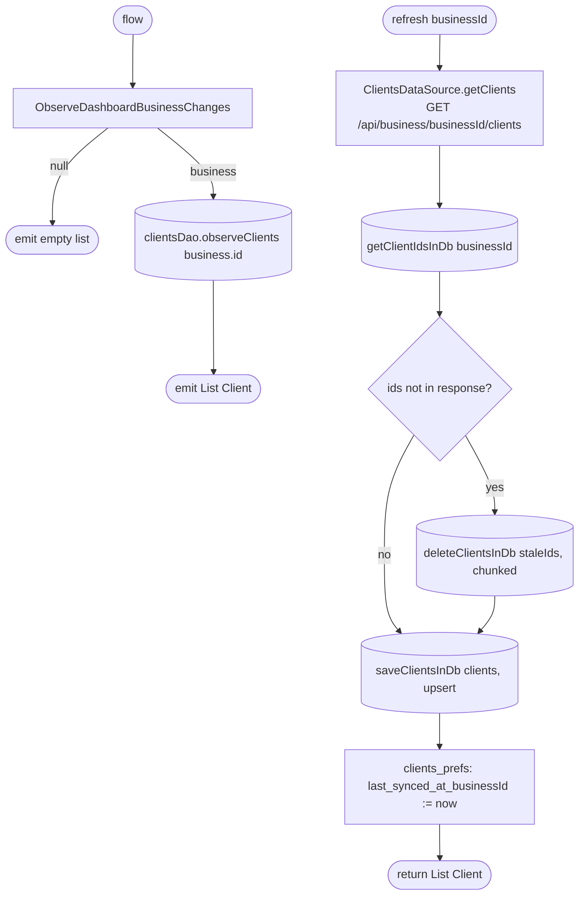

[← Operations](../README.md)

# Get clients list

`GetClientsList.flow()` / `.refresh(businessId)` → `GET /api/business/{businessId}/clients`
· called from `ClientsListViewModel`, [Get appointment options](../appointments/get-appointment-options.md)
and [low-priority data fetch](../authorization/initial-app-data-fetch.md)

This is the reference shape for every cached list in the app (services, service groups, employees,
invitations, appointment requests and per-day appointments all do the same thing).

