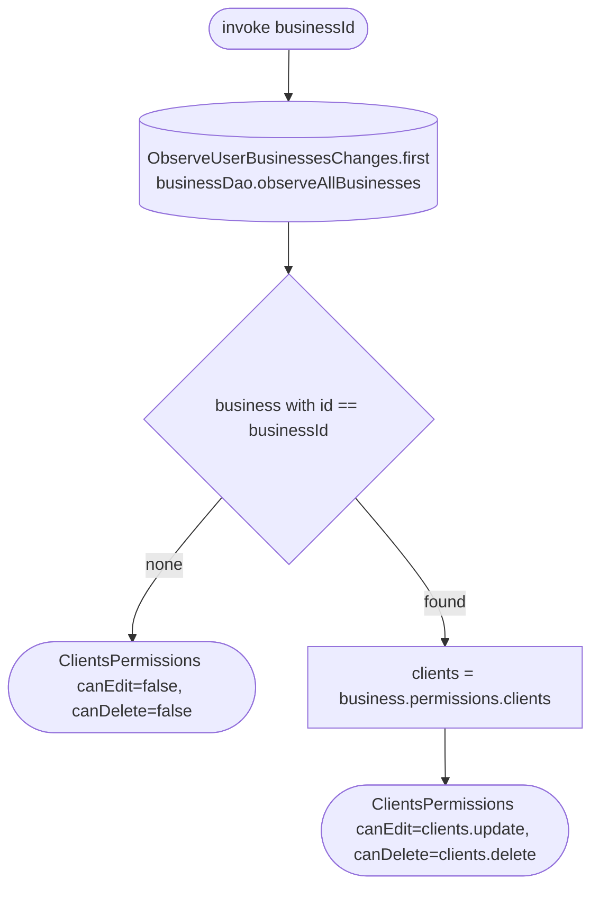

[← Operations](../README.md)

# Get clients permissions

`GetClientsPermissions(businessId)` → local only · called from `ClientsListViewModel`, `ClientDetailsViewModel` and `EditClientViewModel`

A wrapper in the clients domain so `feature/clients/presentation` does not depend on the business domain.
It takes the first emission of `ObserveUserBusinessesChanges` (the cached `business` rows), finds the business and
maps the current user's `permissions.clients` grant to `ClientsPermissions(canEdit = update, canDelete = delete)`.
A business that is not cached denies both.

- `ClientsListViewModel` re-checks it on every current-business change (keyed `launch`, so a stale result is
  dropped) and shows the "add client" toolbar action only with `canEdit`.
- `ClientDetailsViewModel` shows the "Edit" toolbar action only with `canEdit`.
- `EditClientViewModel` shows the delete button only with `canDelete`.

