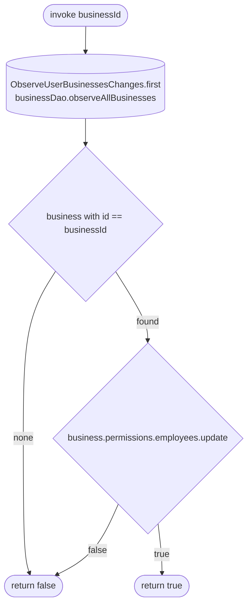

[← Operations](../README.md)

# Can edit employees

`CanEditEmployees(businessId)` → local only · called from `EditEmployeeViewModel` and `EmployeeListViewModel`

A wrapper in the employees domain so `feature/employees/presentation` does not depend on the business domain.
It takes the first emission of `ObserveUserBusinessesChanges` (the cached `business` rows), finds the business
and returns the current user's `permissions.employees.update` grant. A business that is not cached counts as
"cannot edit". `EditEmployeeViewModel` uses the result to hide the save button and the permissions section and to
make the services picker and schedule read-only; `EmployeeListViewModel` re-checks it on every current-business
change and shows the "add employee" toolbar action only when it returns `true`.

