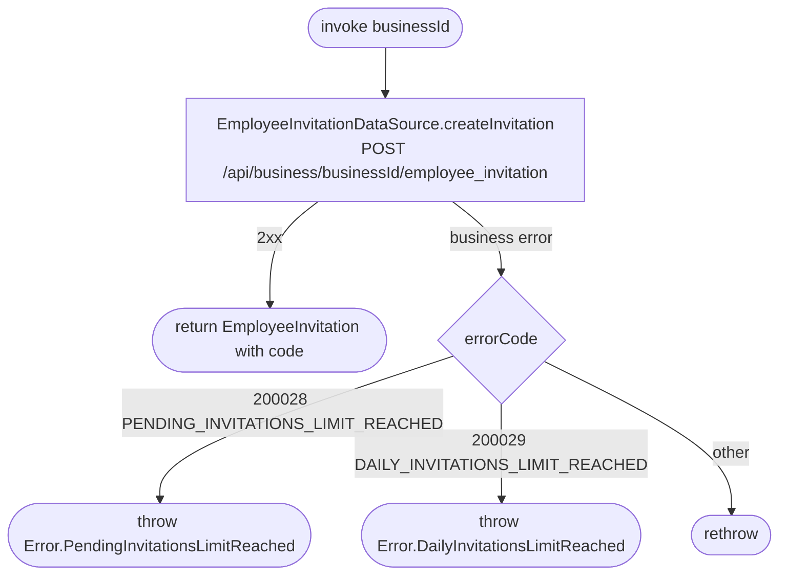

[← Operations](../README.md)

# Create employee invitation

`CreateEmployeeInvitation(businessId)` → `POST /api/business/{businessId}/employee_invitation`
· called from `InviteEmployeeViewModel`

The only moment the **plaintext invite code** is available. The server stores only its hash. The code is
returned to the caller for sharing and is **not** written to `employee_invitation`. The invitation shows up in
the cached list on the next [Get employee invitations](get-employee-invitations.md) refresh, with `code = null`.

