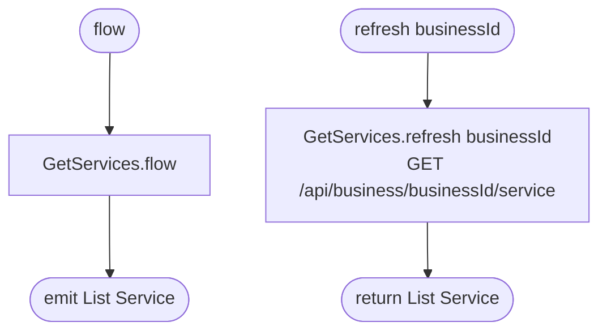

[← Operations](../README.md)

# Get assignable services

`GetAssignableServices.flow()` / `.refresh(businessId)` → delegates to [Get services](../services/get-services.md)
· called from `EditEmployeeViewModel`

A wrapper in the employees domain so `feature/employees/presentation` does not depend on the services domain.
It returns the business services unchanged. They are the options of the services picker on the edit employee
screen.

