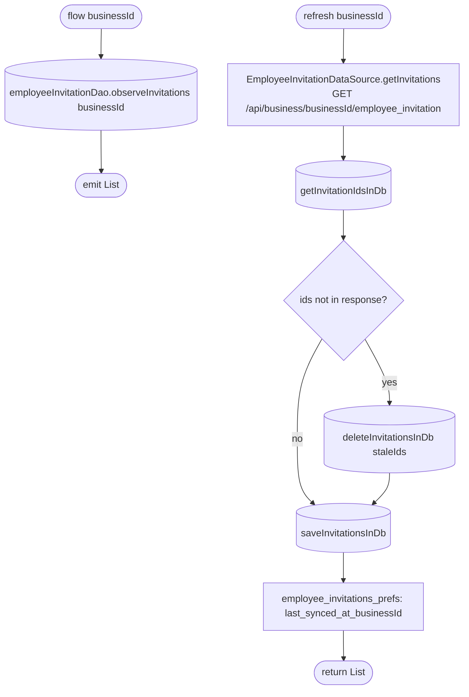

[← Operations](../README.md)

# Get employee invitations

`GetEmployeeInvitations.flow(businessId)` / `.refresh(businessId)` →
`GET /api/business/{businessId}/employee_invitation` · called from `InviteEmployeeViewModel`

The same list steps as [Get clients list](../clients/get-clients-list.md). Unlike most lists, `flow` takes an
explicit `businessId` instead of following the dashboard business.

