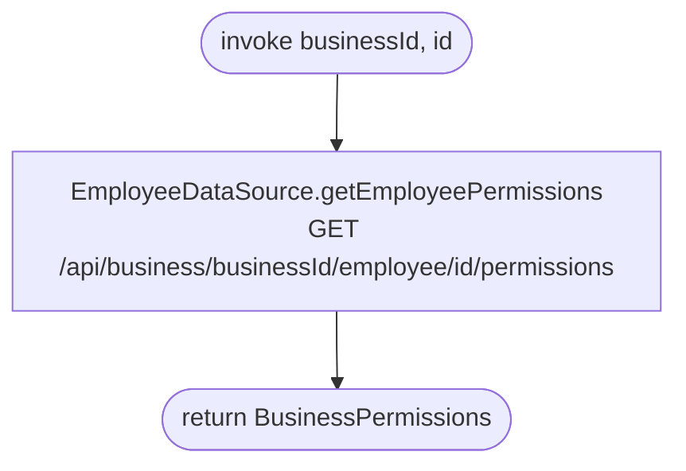

[← Operations](../README.md)

# Get employee permissions

`GetEmployeePermissions(businessId, id)` → `GET /api/business/{businessId}/employee/{id}/permissions`
· **no view model calls it yet**

Network only. It returns another employee's grants across all five resources. This is not the same as the
current user's own grants, which are stored on the `business` row.

