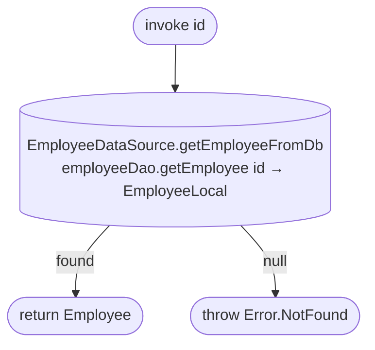

[← Operations](../README.md)

# Get employee

`GetEmployee(id)` → local only · called from `EditEmployeeViewModel`

Reads one cached employee (with schedule, services and permissions) by id. There is no network call: the
employee list screen that opens the edit screen has already refreshed the cache.

