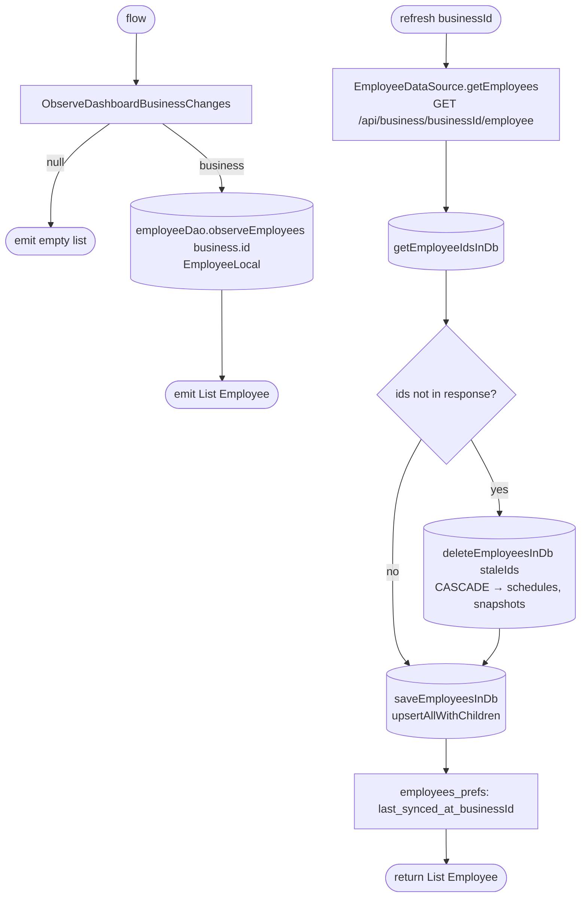

[← Operations](../README.md)

# Get employees

`GetEmployees.flow()` / `.refresh(businessId)` → `GET /api/business/{businessId}/employee`
· called from `EmployeeListViewModel` and [low-priority data fetch](../authorization/initial-app-data-fetch.md)

The same list steps as [Get clients list](../clients/get-clients-list.md). Each employee is saved as an
aggregate: `upsertAllWithChildren` replaces the day schedules, work hours, days off and service snapshots of
each employee in the response.

