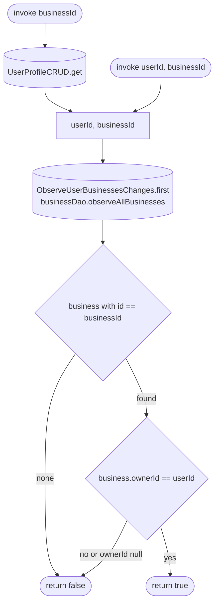

[← Operations](../README.md)

# Is business owner

`IsBusinessOwner(userId, businessId)` / `IsBusinessOwner(businessId)` → local only · called from
`EditEmployeeViewModel` and [Update employee](update-employee.md)

A wrapper in the employees domain so `feature/employees/presentation` does not depend on the business or
authorization domains. Both overloads take the first emission of `ObserveUserBusinessesChanges` (the cached
`business` rows), find the business and compare its `ownerId` with a user id:

- `invoke(userId, businessId)` checks the given user — used with an employee's `userId` to ask whether that
  employee is the owner.
- `invoke(businessId)` checks the current user, whose id comes from `UserProfileCRUD.get()` (the cached profile,
  or `GET /api/user/me` when it is not cached yet).

A business that is not cached, or a row cached before `ownerId` existed (`NULL` until the next refresh), counts
as "not the owner".

`EditEmployeeViewModel` shows the permission toggles only when the current user owns the business and the edited
employee is not the owner. In every other case it shows only the hint that the owner alone can change permissions.

