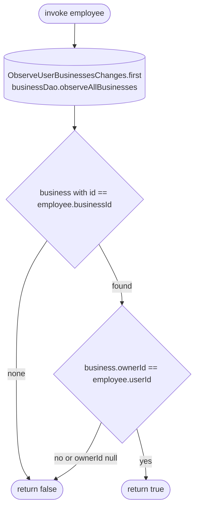

[← Operations](../README.md)

# Is business owner

`IsBusinessOwner(employee)` → local only · called from `EditEmployeeViewModel` and [Update employee](update-employee.md)

A wrapper in the employees domain so `feature/employees/presentation` does not depend on the business domain.
It takes the first emission of `ObserveUserBusinessesChanges` (the cached `business` rows), finds the
employee's business and compares its `ownerId` with the employee's `userId`. A business that is not cached, or a
row cached before `ownerId` existed (`NULL` until the next refresh), counts as "not the owner".

