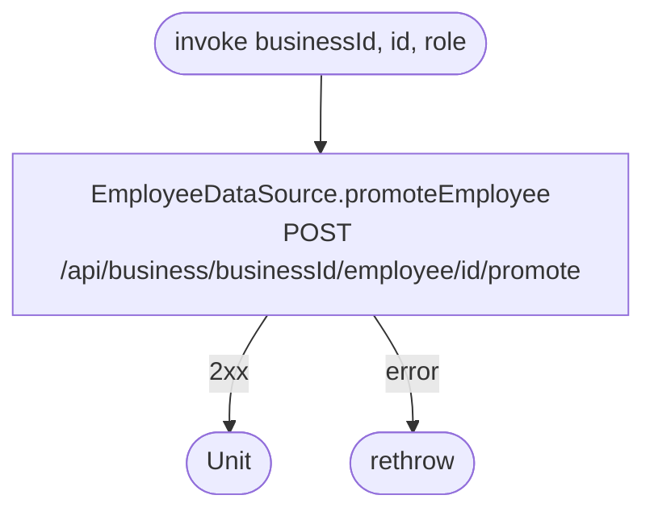

[← Operations](../README.md)

# Promote employee

`PromoteEmployee(businessId, id, role)` → `POST /api/business/{businessId}/employee/{id}/promote`
· **no view model calls it yet**

Network only, with no error mapping and no local write.

