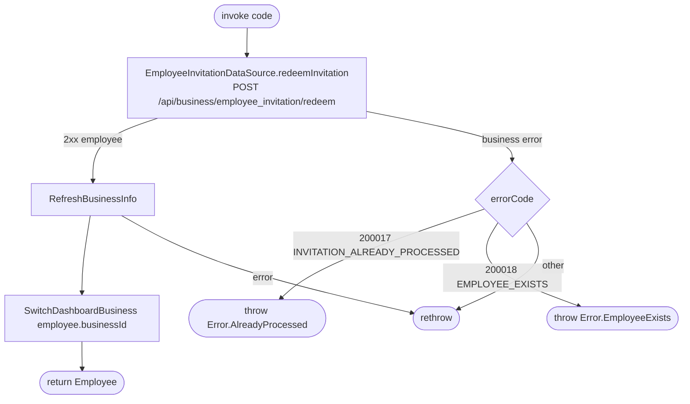

[← Operations](../README.md)

# Redeem employee invitation

`RedeemEmployeeInvitation(code)` → `POST /api/business/employee_invitation/redeem`
· called from [Join business](../business/join-business.md)

After joining, the use case re-syncs the business list (the new business and the user's grants in it only
exist on the server so far) and then switches the dashboard to that business. The business-error mapping
wraps the *whole* block. If the refresh or the switch fails after a successful redeem, the raw error
propagates, even though the user has already joined.

Composes [Refresh business info](../business/refresh-business-info.md) and [Switch dashboard business](../business/switch-dashboard-business.md).
