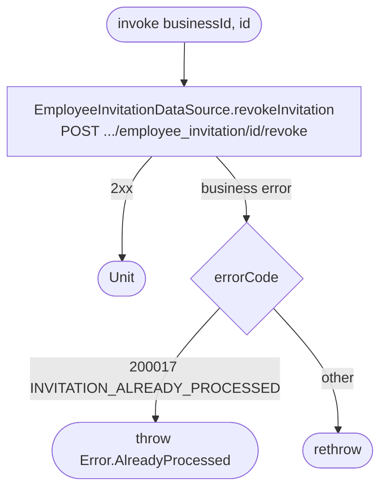

[← Operations](../README.md)

# Revoke employee invitation

`RevokeEmployeeInvitation(businessId, id)` → `POST /api/business/{businessId}/employee_invitation/{id}/revoke`
· called from `InviteEmployeeViewModel`

Network only. The cached invitation row keeps its old status until the next [Get employee
invitations](get-employee-invitations.md) refresh.

