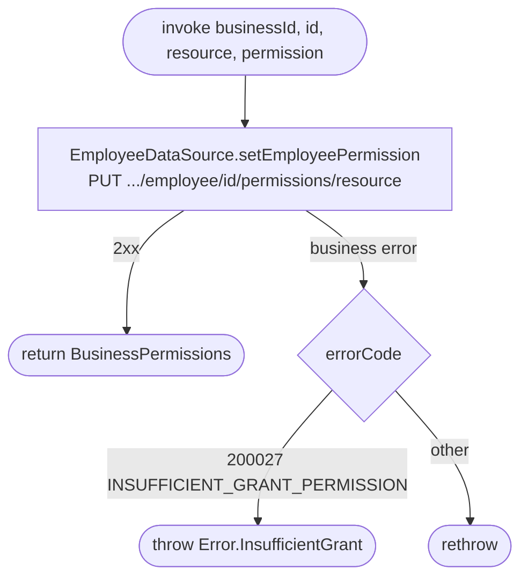

[← Operations](../README.md)

# Set employee permission

`SetEmployeePermission(businessId, id, resource, permission)` →
`PUT /api/business/{businessId}/employee/{id}/permissions/{resource}` · **no view model calls it yet**

`resource` goes on the wire as `BusinessResource.name.lowercase()` (`business`, `employees`, `clients`,
`services`, `appointments`). The response is the employee's full updated grant set. Nothing is cached.

