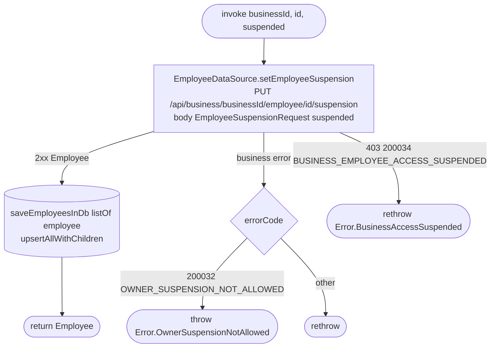

[← Operations](../README.md)

# Set employee suspension

`SetEmployeeSuspension(businessId, id, suspended)` → `PUT /api/business/{businessId}/employee/{id}/suspension`
· called from `EditEmployeeViewModel` after the owner confirms the suspend or reinstate dialog

Suspends an employee (`suspended = true`) or reinstates one (`suspended = false`). The body is an
`EmployeeSuspensionRequest` with one required `suspended` flag. It has no default value, so `false` is still
written to the wire. The backend answers with the whole `Employee`, whose `suspendedAt` is set while the employee
is suspended and `null` once reinstated. A suspended employee keeps their stored permissions, but the backend
treats them as having none and clients cannot book them. Asking for the state the employee is already in
changes nothing and returns the employee as it is.

Only the business owner can call this route. For anyone else, and for an unknown employee, the backend answers
`404`, which reaches the caller as a plain `Error.BusinessError`. The owner cannot be suspended: the backend
answers `422` with `BUSINESS_OWNER_SUSPENSION_NOT_ALLOWED` (200032).

The returned employee is upserted into the `employee` tables, so the employee list and edit screen show the new
state right away. On failure nothing is written.

