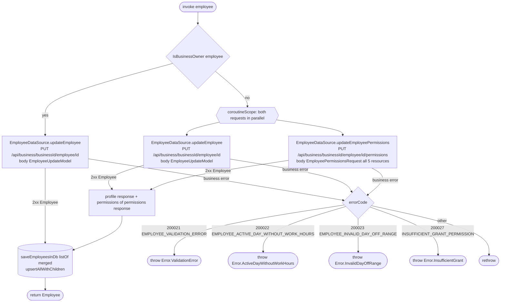

[← Operations](../README.md)

# Update employee

`UpdateEmployee(employee)` → `PUT /api/business/{businessId}/employee/{id}` **and**
`PUT /api/business/{businessId}/employee/{id}/permissions`, sent concurrently (the permissions request is skipped
for the business owner) · called from `EditEmployeeViewModel`

It first asks [Is business owner](is-business-owner.md). The backend rejects every permissions request for the
owner with `BUSINESS_OWNER_PERMISSIONS_IMMUTABLE` (200030), because the owner always has full access. So for
the owner only the profile request is sent, and its response, including the unchanged permissions, is saved and
returned.

The profile, services and schedule go in an `EmployeeUpdateModel`. The permissions go in an
`EmployeePermissionsRequest`, which has one optional `ResourcePermission` field per resource (`business`,
`employees`, `clients`, `services`, `appointments`). The backend keeps the current grant of an omitted field.
The client always sends all five fields. The two requests run in
parallel (`coroutineScope` + two `async`). The returned employee takes its profile, services and schedule from
the first response and its `permissions` from the second, and is then upserted into the `employee` tables so the
list and the edit screen show it right away.

If either request fails, the other is cancelled, nothing is written to the database, and the error is mapped
below. The backend may already have applied the request that finished first. The next
[Get employees](get-employees.md) refresh brings the cache back in line.

