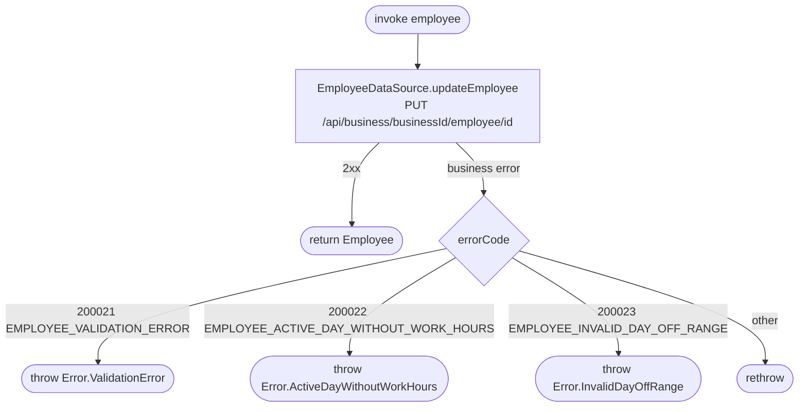

[← Operations](../README.md)

# Update employee

`UpdateEmployee(employee)` → `PUT /api/business/{businessId}/employee/{id}`
· **no view model calls it yet**

Network only. The server response is returned but **not written to `employee`**, so the cached list stays
stale until the next [Get employees](get-employees.md) refresh.

