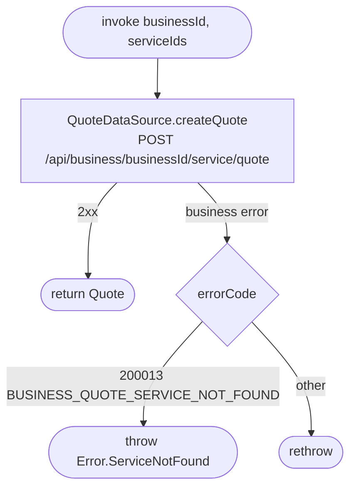

[← Operations](../README.md)

# Create quote

`CreateQuote(businessId, serviceIds)` → `POST /api/business/{businessId}/service/quote`
· **no callers yet**

Asks the server for a signed price and duration quote (`offerToken`) for a set of services. It is meant for the
client-side booking flow (`AppointmentRequestDataSource.createAppointmentRequest(request, offerToken)`,
which also has no use case yet). Nothing is persisted.

