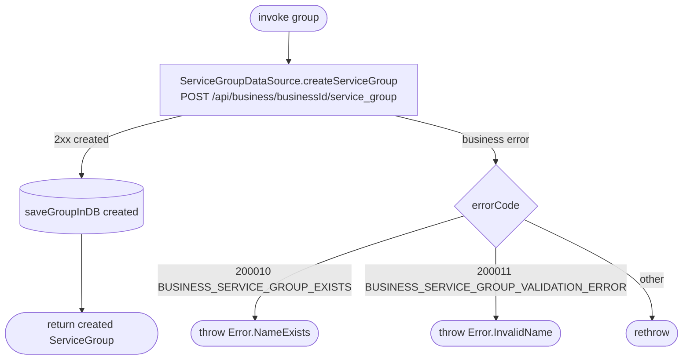

[← Operations](../README.md)

# Create service group

`CreateServiceGroup(group)` → `POST /api/business/{businessId}/service_group`
· called from `AddGroupViewModel`

```mermaid
flowchart TD
    Start([invoke group]) --> Net[ServiceGroupDataSource.createServiceGroup<br/>POST /api/business/businessId/service_group]
    Net -- 2xx created --> Save[(saveGroupInDB created)]
    Save --> R([return created ServiceGroup])
    Net -- business error --> Code{errorCode}
    Code -- 200010 BUSINESS_SERVICE_GROUP_EXISTS --> E1([throw Error.NameExists])
    Code -- 200011 BUSINESS_SERVICE_GROUP_VALIDATION_ERROR --> E2([throw Error.InvalidName])
    Code -- other --> EX([rethrow])
```
