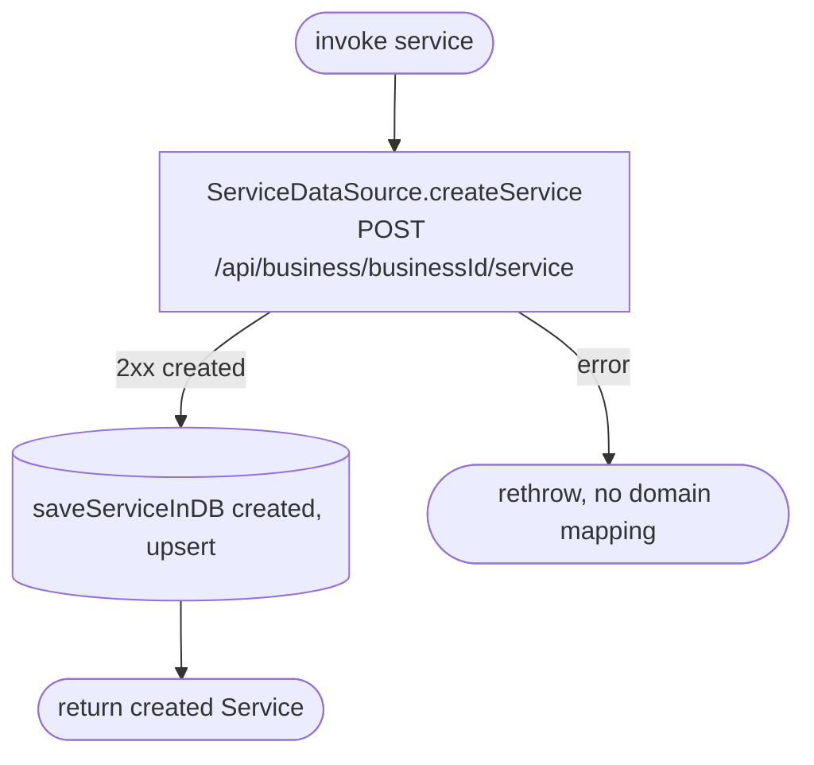

[← Operations](../README.md)

# Create service

`CreateService(service)` → `POST /api/business/{businessId}/service`
· called from `AddServiceViewModel`

The local upsert assumes the service's group is already in `service_group`. If it is not, the
`service.groupId` foreign key fails and the create **looks failed even though it succeeded on the server**.
`AddServiceViewModel` only offers groups from [Get service groups](get-service-groups.md), which were cached.
