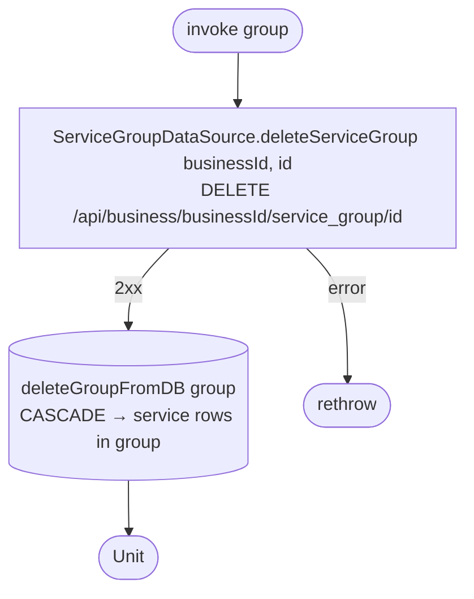

[← Operations](../README.md)

# Delete service group

`DeleteServiceGroup(group)` → `DELETE /api/business/{businessId}/service_group/{id}`
· called from `ServiceGroupListViewModel`

The local delete **cascades** to every cached `service` in the group (`service.groupId` has `ON DELETE CASCADE`).
Whatever the server does with the group's services, the next [Get services](get-services.md) refresh
reconciles the local list.

