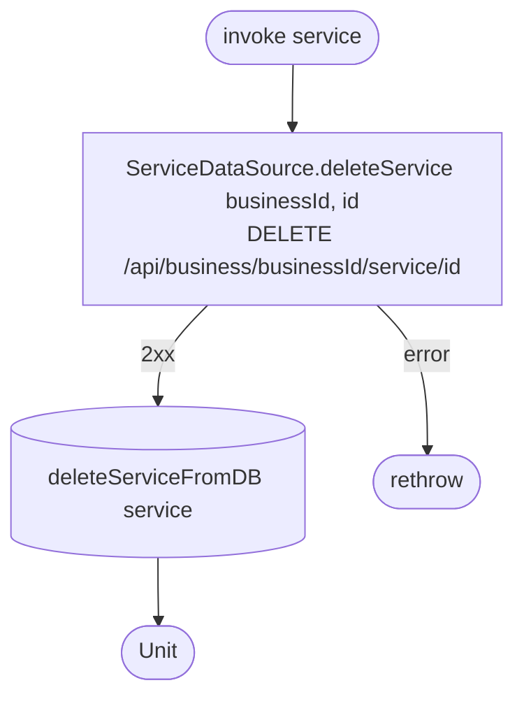

[← Operations](../README.md)

# Delete service

`DeleteService(service)` → `DELETE /api/business/{businessId}/service/{id}`
· called from `ServiceListViewModel`

Snapshots of the service in `appointment_service_snapshot` and `employee_service_snapshot` are kept, because
they have no foreign key to `service`.
