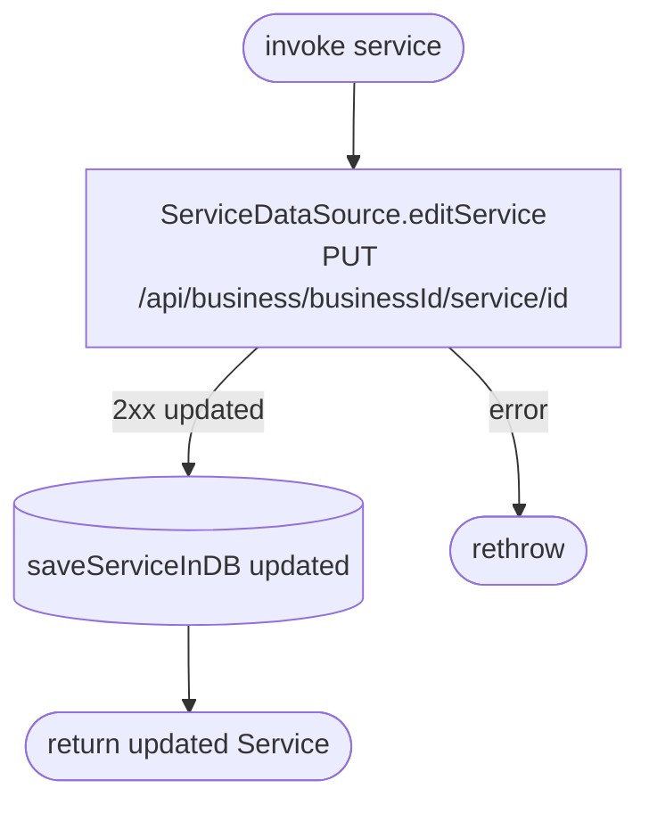

[← Operations](../README.md)

# Edit service

`EditService(service)` → `PUT /api/business/{businessId}/service/{id}`
· called from `EditServiceViewModel`

```mermaid
flowchart TD
    Start([invoke service]) --> Net[ServiceDataSource.editService<br/>PUT /api/business/businessId/service/id]
    Net -- 2xx updated --> Save[(saveServiceInDB updated)]
    Save --> R([return updated Service])
    Net -- error --> EX([rethrow])
```
