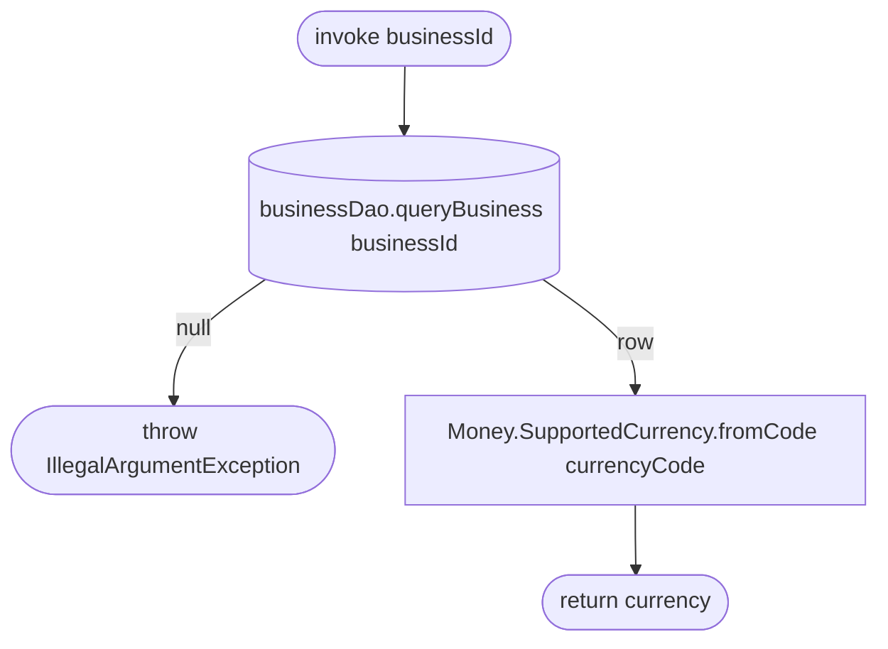

[← Operations](../README.md)

# Get business currency

`GetBusinessCurrency(businessId)` → **local only**, `businessDao.queryBusiness(businessId).currencyCode`
· called from `AddServiceViewModel`

`ServiceDataSourceImpl` reads the `business` table owned by the business feature directly, going through the
shared `BusinessDao`. The business must be cached. Otherwise `requireNotNull` throws.

