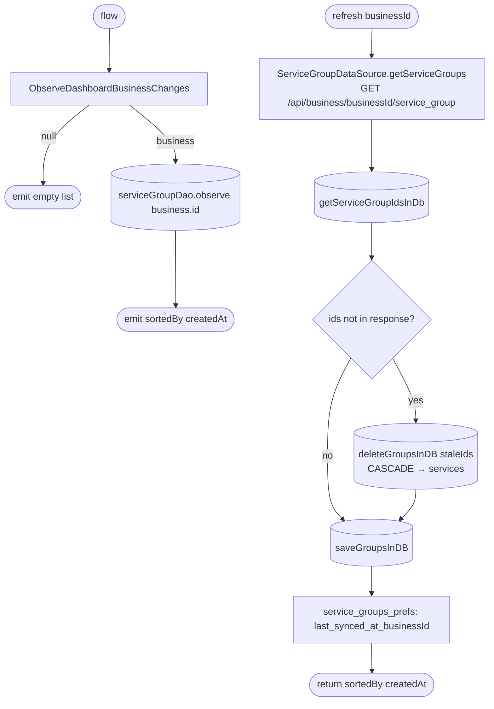

[← Operations](../README.md)

# Get service groups

`GetServiceGroups.flow()` / `.refresh(businessId)` → `GET /api/business/{businessId}/service_group`
· called from `ServiceGroupListViewModel`, `AddServiceViewModel` and [low-priority data fetch](../authorization/initial-app-data-fetch.md)

The same list steps as [Get clients list](../clients/get-clients-list.md). Both paths sort by `createdAt`.
Deleting stale groups locally cascades to their cached services.

