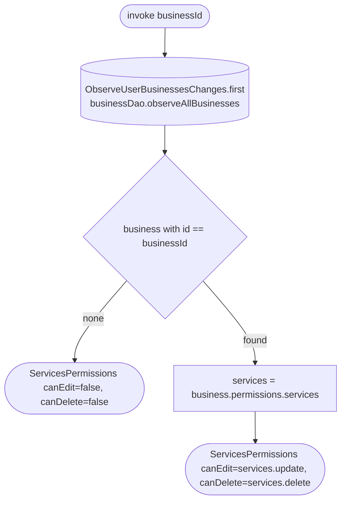

[← Operations](../README.md)

# Get services permissions

`GetServicesPermissions(businessId)` → local only · called from `ServiceListViewModel` and `ServiceGroupListViewModel`

A wrapper in the services domain so `feature/services/presentation` does not depend on the business domain.
It takes the first emission of `ObserveUserBusinessesChanges` (the cached `business` rows), finds the business and
maps the current user's `permissions.services` grant to `ServicesPermissions(canEdit = update, canDelete = delete)`.
Services and service groups share this grant. A business that is not cached denies both.

Both list ViewModels re-check it on every current-business change (keyed `launch`, so a stale result is dropped):
the "add" toolbar action is only added with `canEdit`, and each row's delete callback is `null` (no swipe, context
menu or long-press menu) without `canDelete`. Rows already on screen are re-rendered when the result arrives.

