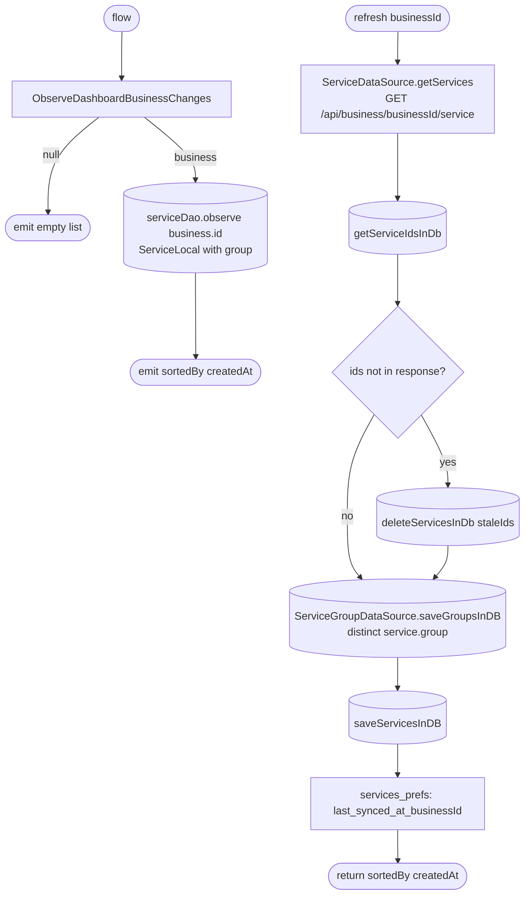

[← Operations](../README.md)

# Get services

`GetServices.flow()` / `.refresh(businessId)` → `GET /api/business/{businessId}/service`
· called from `ServiceListViewModel`, [Get appointment options](../appointments/get-appointment-options.md)
and [low-priority data fetch](../authorization/initial-app-data-fetch.md)

The same list steps as [Get clients list](../clients/get-clients-list.md), with one addition: before the
services are upserted, the distinct groups embedded in the response are upserted into `service_group`, so the
`service.groupId` foreign key always holds.

