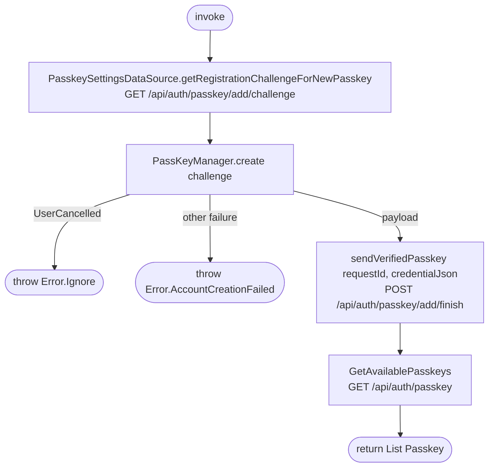

[← Operations](../README.md)

# Create new passkey

`CreateNewPasskey()` → `GET /api/auth/passkey/add/challenge`, then `POST /api/auth/passkey/add/finish`
· called from `PasskeyViewModel`

Registers an additional passkey on the signed-in account and returns the refreshed list. Nothing is cached.

