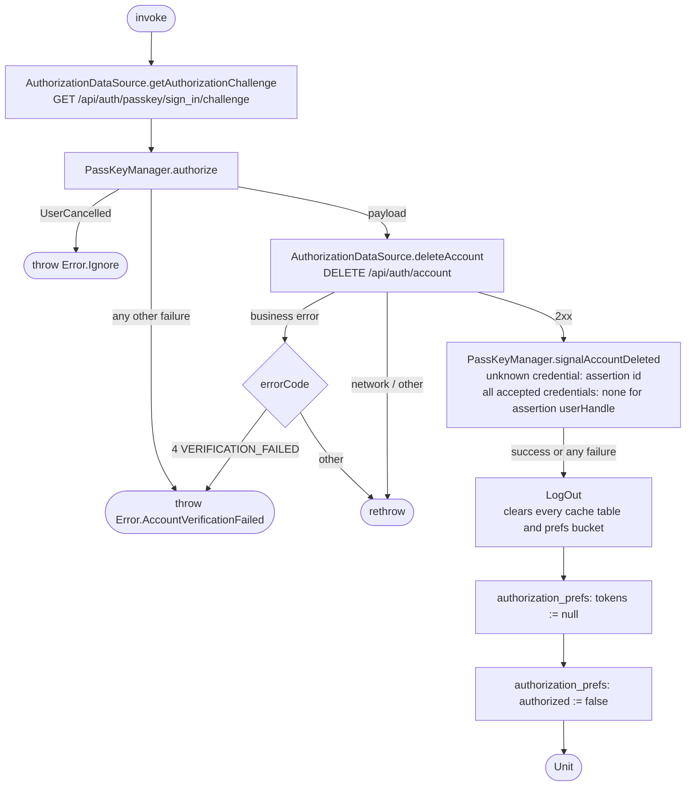

[← Operations](../README.md)

# Delete account

`DeleteAccount()` → `GET /api/auth/passkey/sign_in/challenge`, then `DELETE /api/auth/account`
· called from `DeleteAccountViewModel`

The user re-authenticates with a passkey, and the signed assertion authorizes the deletion. On success the
app signals the device's credential providers that the account's passkeys are gone, then the tokens are
cleared and `authorized` is set to false, which sends the app to Login.

A failure before or during the remote deletion leaves the session and caches untouched, and no signal is
sent.

`signalAccountDeleted` is best-effort: any failure is swallowed because the account is already deleted on the
server. It reads `id` and `response.userHandle` from the assertion JSON and forwards them to
`PasskeyCredentialUpdater`, which each platform supplies through `StateFactoryCreator.createPasskeyCredentialUpdater()`.
Android (`AndroidPasskeyCredentialUpdater`) sends `SignalUnknownCredentialRequest` and
`SignalAllAcceptedCredentialIdsRequest` (empty list) via `CredentialManager.signalCredentialState`. iOS
(`IOSPasskeyCredentialUpdater`, in Swift because `ASCredentialUpdater` is Swift-only) calls
`reportUnknownPublicKeyCredential` and `reportAllAcceptedPublicKeyCredentials` (empty list). The all-accepted
signal is skipped when the assertion has no `userHandle`.

After a successful deletion, [Log out](../authorization/log-out.md) runs every `LogOutAction`. Its `DELETE /api/auth/session`
call fails because the account no longer exists, and that failure is swallowed like any other logout
action error.
