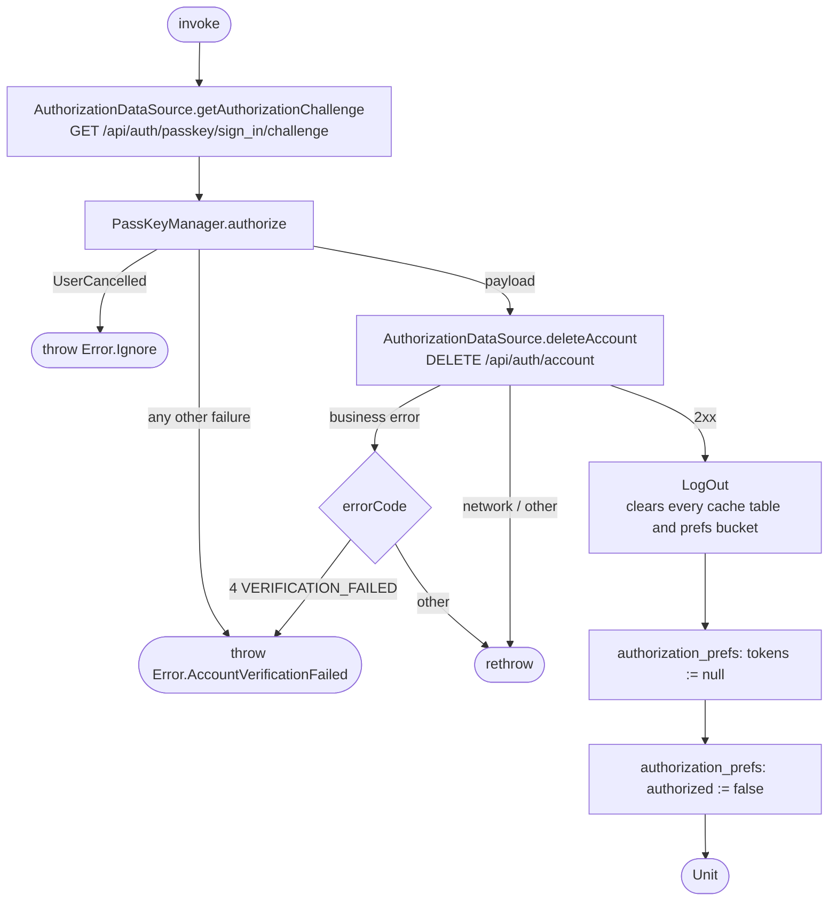

[← Operations](../README.md)

# Delete account

`DeleteAccount()` → `GET /api/auth/passkey/sign_in/challenge`, then `DELETE /api/auth/account`
· called from `DeleteAccountViewModel`

The user re-authenticates with a passkey, and the signed assertion authorizes the deletion. On success the
tokens are cleared and `authorized` is set to false, which sends the app to Login.

A failure before or during the remote deletion leaves the session and caches untouched. After a successful
deletion, [Log out](../authorization/log-out.md) runs every `LogOutAction`. Its `DELETE /api/auth/session`
call fails because the account no longer exists, and that failure is swallowed like any other logout
action error.
