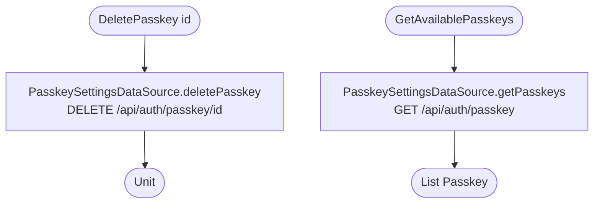

[← Operations](../README.md)

# Delete passkey / Get available passkeys

`DeletePasskey(id)` → `DELETE /api/auth/passkey/{id}` · `GetAvailablePasskeys()` → `GET /api/auth/passkey`
· both called from `PasskeyViewModel`. `GetAvailablePasskeys` is also called by [Create new passkey](create-new-passkey.md).

Network only, with no error mapping and no cache.

