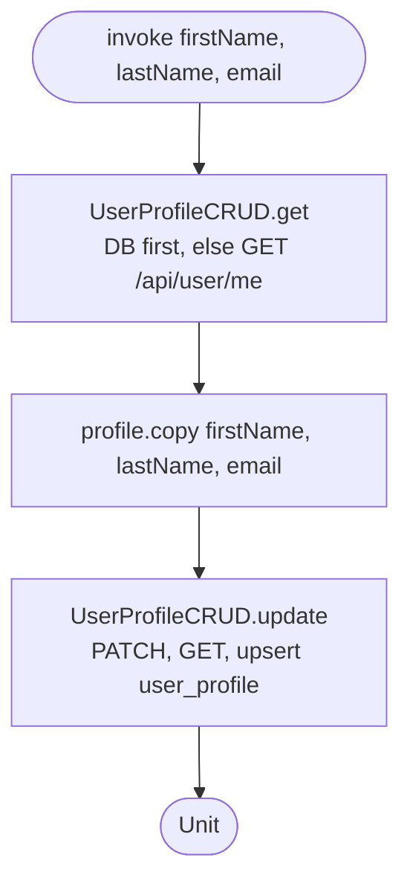

[← Operations](../README.md)

# Edit profile

`EditProfile(firstName, lastName, email)` → `PATCH /api/user/me`
· called from `EditProfileViewModel` and `SettingsDashboardViewModel`

See [User profile CRUD](../authorization/user-profile-crud.md) for the update steps.
