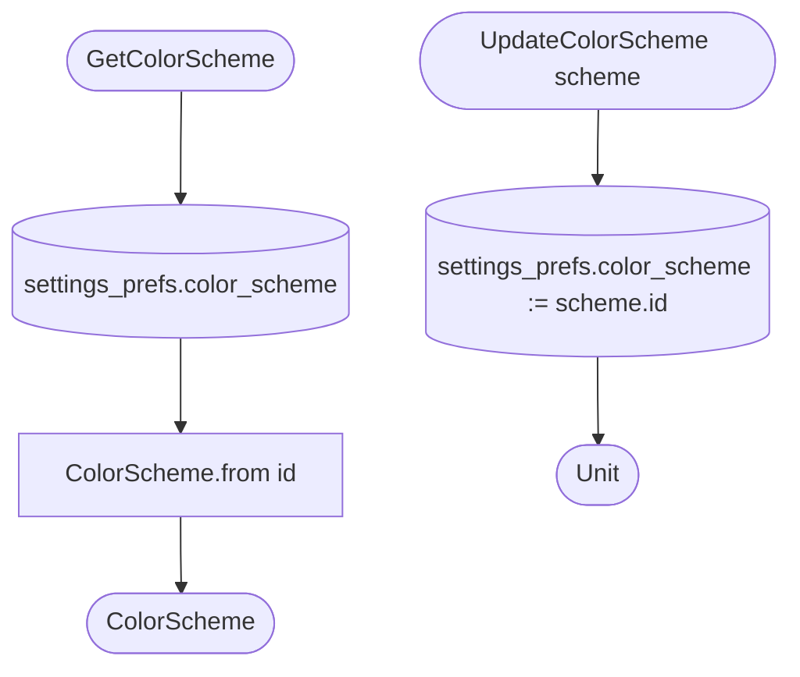

[← Operations](../README.md)

# Get / update color scheme

`GetColorScheme()` / `.asFlow()` and `UpdateColorScheme(scheme)`, **local only** (`settings_prefs.color_scheme`)
· `GetColorScheme` is called through [Get settings](get-settings.md) and `authorization`'s `GetSettingsColorScheme`.
`UpdateColorScheme` is called from `SettingsDashboardViewModel`.

The scheme is stored as its numeric `id`. `ColorScheme.from(null)` resolves to the default (system). This is a
device preference and is intentionally not cleared on logout.

