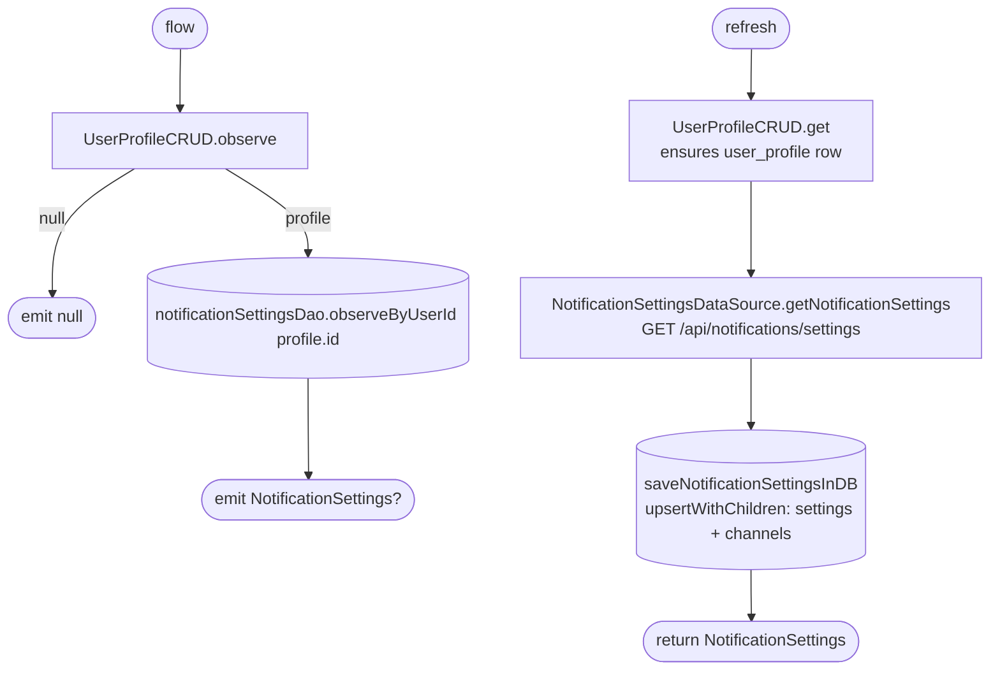

[← Operations](../README.md)

# Get notification settings

`GetNotificationSettings.flow()` / `.refresh()` → `GET /api/notifications/settings`
· called from `NotificationSettingsViewModel` and [low-priority data fetch](../authorization/initial-app-data-fetch.md)

`flow` is keyed on the cached profile's id. It emits `null` while there is no profile row. `refresh` calls
`UserProfileCRUD.get()` first, which fetches and caches the profile if it is missing. That wakes up `flow` as
a side effect.

Decide whether a channel is shown by its **presence** in `channels`. Do not use `availableToClients`, which is
always `true`.
