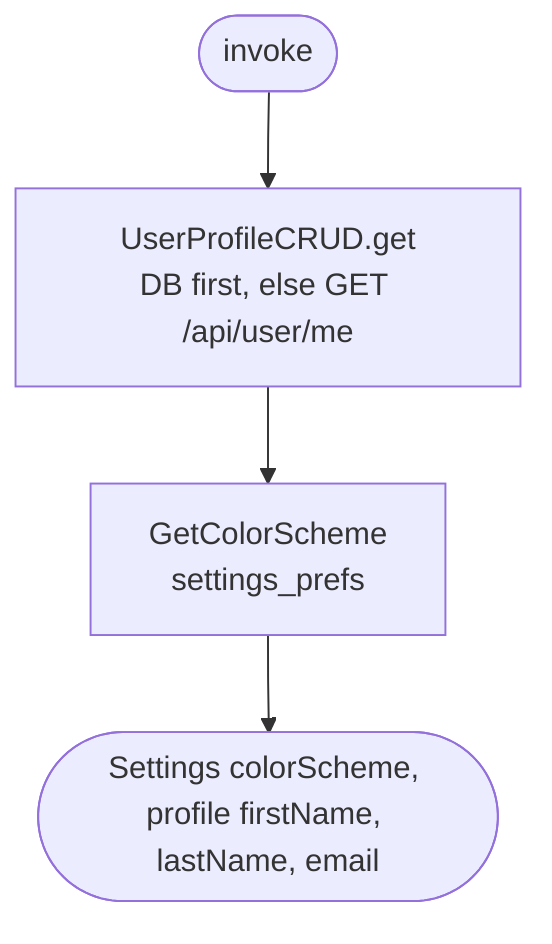

[← Operations](../README.md)

# Get settings

`GetSettings()` → **local-first** · called from `SettingsDashboardViewModel` and `EditProfileViewModel`

```mermaid
flowchart TD
    Start([invoke]) --> P[UserProfileCRUD.get<br/>DB first, else GET /api/user/me]
    P --> C[GetColorScheme<br/>settings_prefs]
    C --> R([Settings colorScheme, profile firstName, lastName, email])
```
