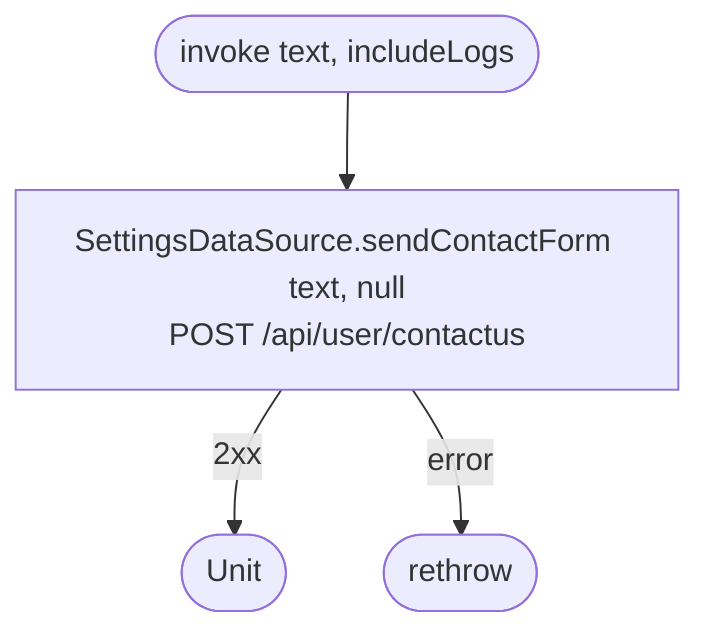

[← Operations](../README.md)

# Send contact form

`SendContactForm(text, includeLogs)` → `POST /api/user/contactus`
· called from `ContactUsViewModel`

`includeLogs` is **ignored** for now: `logs` is always sent as `null` because usage-log collection has not been
built yet.

