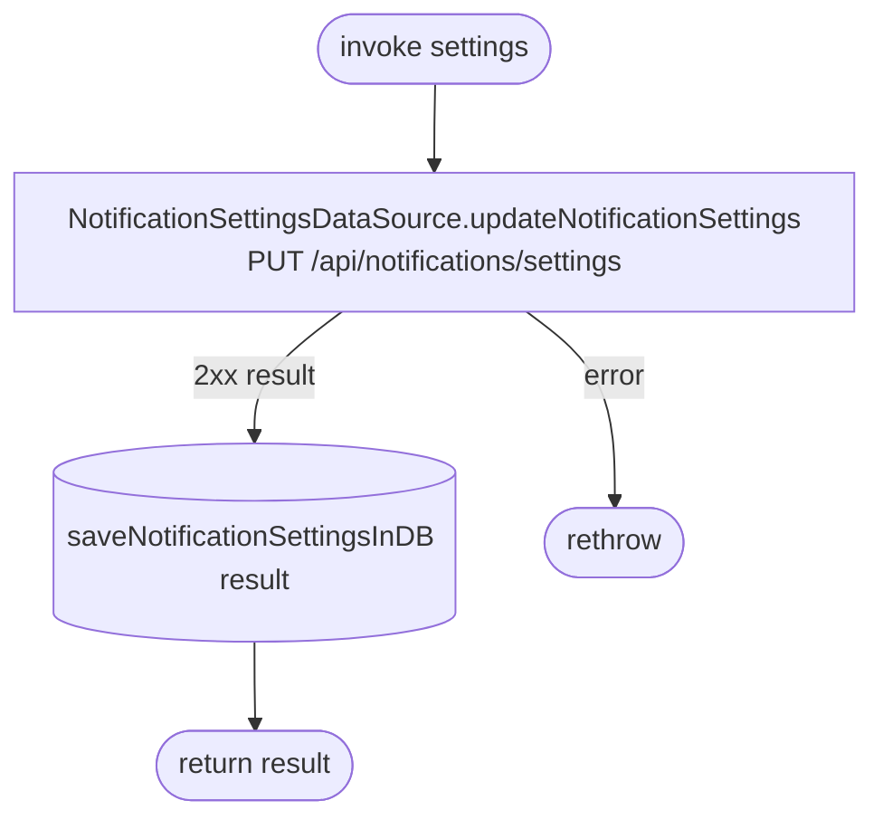

[← Operations](../README.md)

# Update notification settings

`UpdateNotificationSettings(settings)` → `PUT /api/notifications/settings`
· called from `NotificationSettingsViewModel`

```mermaid
flowchart TD
    Start([invoke settings]) --> Net[NotificationSettingsDataSource.updateNotificationSettings<br/>PUT /api/notifications/settings]
    Net -- 2xx result --> Save[(saveNotificationSettingsInDB result)]
    Save --> R([return result])
    Net -- error --> EX([rethrow])
```
